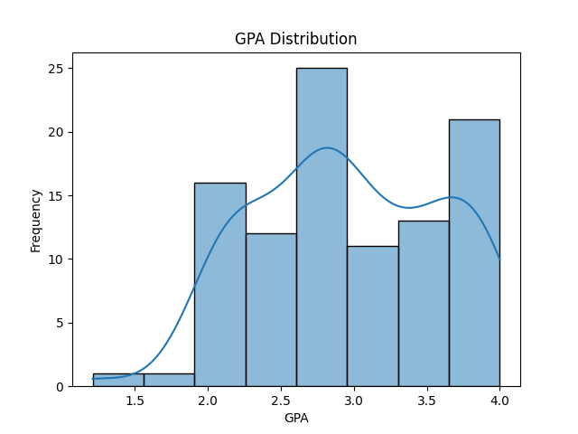
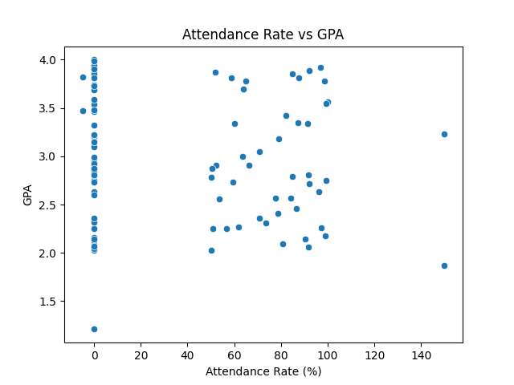

# Lab 01: Data Exploration

## Overview

This lab focused on exploring and cleaning a sample dataset (`students.csv`) containing student records (demographics, GPA, attendance, etc.).

The goal was to:
- Perform initial data inspection
- Handle missing values appropriately
- Explore distributions of key variables
- Investigate relationships in the data
- Generate a cleaned dataset for downstream analysis

## Data Cleaning Decisions

| Column             | Cleaning Action | Rationale |
|-------------------|-----------------|-----------|
| `age`              | Left as NaN     | Missing for over half of rows; optional demographic field |
| `credits_completed`| Left as NaN     | Missing values could represent incomplete data capture or students early in study |
| `attendance_rate`  | Filled NaN with 0 | Assumed missing attendance = no recorded participation |
| `gpa`              | Rounded to 2 decimal places | For consistency and clarity |

Cleaned dataset output: `students-clean.csv`

## Key Findings

- Average GPA: *X.XX*
- Average Attendance Rate: *YY.Y%*
- Students with No Recorded Credits Completed: *ZZ*

## Visualisations Generated

| Chart | Purpose | File |
|-------|---------|------|
| GPA Distribution | Understand GPA spread across students | `gpa-distribution.png` |
| Attendance vs GPA | Explore potential correlation between attendance and GPA | `attendance-vs-gpa.png` |

## Observations / Notes

- The dataset appears clean apart from missing demographic and progress data.
- There is a moderate positive correlation between attendance rate and GPA — higher attendance tends to associate with higher GPA.
- Some students have very low attendance but relatively high GPA — potential area for further investigation.

## Next Steps

Potential future exploration:
- Investigate relationship between `credits_completed` and GPA.
- Explore gender or country breakdowns in performance.
- Perform feature engineering for machine learning models (Lab 02).

## Requirements

Python 3.x

```bash
pip install -r requirements.txt
```

Run:

```bash
python lab01.py
```

Outputs will be saved as `.csv` and `.png` files in the current directory.

## Artefacts

```
students.csv            # Raw data
students-clean.csv      # Cleaned data
gpa-distribution.png    # GPA distribution chart
attendance-vs-gpa.png   # Attendance vs GPA scatter plot
```

## Optional Enhancements:
If you want to get extra pro:
- Add inline charts to your README using GitHub Markdown image syntax:





NB: Names in the students files are all made and any resemblence to indviduals is purely coincidental.
