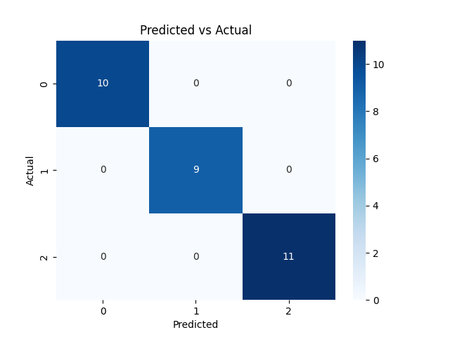

# Lab 02: Scikit-Learn Classifier

## Overview

This lab introduced the basics of training a classification model using **Scikit-Learn**. It used the built-in **Iris dataset**, a classic machine learning benchmark involving flower classification.

The goal was to:
- Load and explore a labeled dataset
- Split data into training and testing subsets
- Train a basic `KNeighborsClassifier`
- Evaluate classification performance
- Visualise model output using a confusion matrix heatmap

## Dataset Used

**Iris Dataset** (Fisher, 1936)
Contains 150 samples of iris flowers with 4 features:
- Sepal length
- Sepal width
- Petal length
- Petal width

Target classes:
- `setosa`
- `versicolor`
- `virginica`

## Step Breakdown

1. **Load Dataset**
   - Loaded via `sklearn.datasets.load_iris()`
   - Features and labels extracted into `pandas` DataFrames

2. **Data Split**
   - 80% for training, 20% for testing
   - `train_test_split(..., test_size=0.2, random_state=42)`

3. **Model Training**
   - Used `KNeighborsClassifier(n_neighbors=3)`
   - Model learns by storing the training set and using distance-based lookup

4. **Prediction & Evaluation**
   - Accuracy calculated on test set: **1.00**
   - Classification report shows perfect scores across all classes
   - Confusion matrix plotted using `seaborn`

5. **Cross-Validation**
   - 5-fold cross-validation accuracy: **0.97**

## Key Outputs

| Metric                     | Value |
|---------------------------|-------|
| Accuracy (Test Set)       | 1.00  |
| Cross-Validation Accuracy | 0.97  |
| Classification Report     | Perfect precision/recall/F1 |
| Confusion Matrix          | No misclassifications |

## Visualisations Generated

| Chart                | Purpose                                | File                     |
|----------------------|----------------------------------------|--------------------------|
| Confusion Matrix     | Show predicted vs. actual classifications | `predicated-vs-actual.png` |

> 📌 Note: Chart includes `xticklabels` and `yticklabels` mapped to flower species for clarity.

## Observations / Notes

- **KNN** performs extremely well on this dataset due to its simplicity and clean structure.
- No parameter tuning was required to achieve perfect performance.
- Dataset is ideal for learning classification workflows and evaluation methods.

## Next Steps

- Experiment with other classifiers: `DecisionTreeClassifier`, `RandomForestClassifier`
- Add feature scaling with `StandardScaler`
- Explore hyperparameter tuning using `GridSearchCV`

## Requirements

Python 3.11

If you use an venv (I do) the run the following before installing the requirements:

```bash
cd data-science-track/01-data-exploration
python -m venv .venv
source .venv/bin/activate
```

Install the requirements

```bash
pip install -r requirements.txt
```

Run:

```bash
python lab02.py
```

Outputs will be saved as a `.png` file in the current directory as outputted to the terminal.

## Artefacts

```
lab02.py                     # Core lab script
predicated-vs-actual.png     # Confusion matrix heatmap
requirements.txt             # Dependencies
README.md                    # This file
```

## Optional Enhancements

- Try different `k` values for KNN (`n_neighbors`)
- Add 2D plots of flower dimensions (e.g. petal length vs width)


