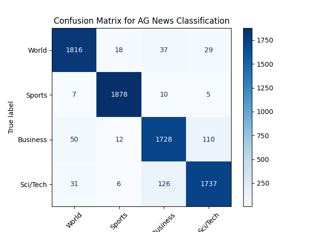

# 🧪 Lab 3: Deep Learning — Text Classification with PyTorch

## 🎯 Objective

Train a text classification model using BERT on the AG News dataset with PyTorch and HuggingFace Transformers. Understand the steps involved in fine-tuning, evaluation, and saving a transformer model for future use.

## 🧰 Tools & Frameworks

- Python 3.11
- PyTorch
- HuggingFace Transformers & Datasets
- Scikit-learn (metrics)
- Matplotlib (for visualisation)
- NVIDIA GeForce RTX 4090 GPU
- libgl1 (libGL)

## 🧵 Workflow Summary

### ✅ Step 1: Load Dataset
- Pulled `ag_news` dataset via `load_dataset("ag_news")`
- Extracted `text` and `label` fields

### ✅ Step 2: Tokenisation
- Used `bert-base-uncased` tokenizer
- Applied padding/truncation and converted to PyTorch tensors

### ✅ Step 3: Dataset Preparation
- Combined `input_ids`, `attention_mask`, and `labels` into a `TensorDataset`
- Wrapped it in a `DataLoader` with batch size 32

### ✅ Step 4: Model Definition
- Loaded `AutoModelForSequenceClassification` with `num_labels=4`
- Model moved to GPU

### ✅ Step 5: Training Loop
- Optimiser: `torch.optim.AdamW`
- Ran training loop over 3 epochs using batches
- Standard backpropagation with loss computation and weight updates

### ✅ Step 6: Evaluation
- Loaded test set
- Tokenised and batched test data
- Evaluated accuracy on unseen data
- Final Accuracy: **94.57%**

### ✅ Step 7: Visualisation
- Generated and saved a confusion matrix to `confusion-matrix.png`

### ✅ Step 8: Save Artifacts
- Saved trained model and tokenizer to `lab03-model/`

## 📈 Output

- ✅ **Accuracy**: `94.57%`
- ✅ **Confusion Matrix**:



- ✅ **Model Saved**: `lab03-model/`

## 🧠 Reflections

- Tokenisation is key: turns human language into something models understand
- Tensors are the building blocks of training data
- Training on GPU was efficient — ~10GB VRAM, 95% usage, ~69°C temp
- The model had some confusion between **Business** and **Sci/Tech**, likely due to content overlap
- All components tied together to produce a working, fine-tuned BERT model ready for optimisation or deployment

## 🚀 Next Steps

- Try LoRA or QLoRA to optimise the model in **Lab 4**
- Introduce additional metrics in **Lab 5** (precision, recall, F1)
- Package model behind an API and serve it using FastAPI or Triton in the **Platform Labs**

## 🧠 Concepts Deep Dive

### ✅ Step 2: Tokenisation (What Really Happens)
The tokenizer is like a translator — it takes human-readable text and turns it into something the model understands: numbers. Specifically, it:
- Splits text into smaller known pieces called **subwords** (e.g., "unbelievable" → "un", "##believ", "##able")
- Maps each subword to a **token ID** from a pretrained vocabulary
- Adds **special tokens** like `[CLS]` (start) and `[SEP]` (end)
- Applies **padding** to make all sequences the same length
- Outputs a tensor dictionary with:
  - `input_ids`: token IDs
  - `attention_mask`: 1s for real tokens, 0s for padding

This step ensures the text is aligned with the way the pretrained BERT model was trained — it's the bridge between language and math.

### ✅ Step 3: TensorDataset (What It's Really Doing)
After tokenisation, we have multiple tensors: `input_ids`, `attention_mask`, and `labels`. `TensorDataset` simply bundles these together so PyTorch can treat them as a single unit — like rows in a spreadsheet:
- Each item = one row of input → (`input_ids`, `attention_mask`, `label`)
- When paired with a `DataLoader`, it supports batching, shuffling, and efficient iteration

This format is essential for PyTorch to feed batches into the model during training.

### ✅ Step 5: AdamW Optimiser (What It Means)
`AdamW` is the algorithm that updates the model's internal parameters as it learns. It decides:
- How much to change weights based on the **loss**
- How to adjust learning per parameter using **adaptive learning rates**
- How to prevent overfitting via **weight decay** (that's the “W”)

You can think of it like the steering wheel for the model's learning process — guiding it through the training data by adjusting how it “thinks.”

------

## 📦 What's in `lab03-model/`?

The `lab03-model/` directory contains everything needed to reload, serve, or optimise your fine-tuned BERT model. Here's a breakdown of each file:

| File                     | Description |
|--------------------------|-------------|
| `config.json`            | Describes the model architecture (e.g., number of labels, model type, hidden sizes). Required when reloading the model. |
| `model.safetensors`      | The actual trained model weights in HuggingFace's `safetensors` format — a secure, efficient alternative to `.bin`. |
| `special_tokens_map.json` | Maps tokens like `[CLS]`, `[SEP]`, and `[PAD]` to their special roles in the tokenizer. |
| `tokenizer_config.json`  | Metadata about how the tokenizer was configured — casing, truncation, padding strategy, etc. |
| `tokenizer.json`         | A full serialised representation of the tokenizer — includes the subword vocabulary and tokenisation rules. |
| `vocab.txt`              | The original vocabulary list used by the tokenizer — one subword/token per line. |

### 🔄 How These Work Together

To **load the model later**, you just need the path:

```python
from transformers import AutoModelForSequenceClassification, AutoTokenizer

model = AutoModelForSequenceClassification.from_pretrained("lab03-model")
tokenizer = AutoTokenizer.from_pretrained("lab03-model")
```

This reloads:
- The fine-tuned model with your trained weights
- The exact tokenizer config and vocab used during training

### 🛠 Use Cases for This Directory

- ✅ Load and run predictions (inference)
- 🔁 Resume fine-tuning later
- 🧪 Optimise with LoRA or quantisation in Lab 4
- 🚀 Convert to ONNX or TorchScript for deployment
- 🔌 Serve it behind an inference API in Platform Labs

Keep this directory version-controlled or backed up — it's your portable, production-ready artefact.
