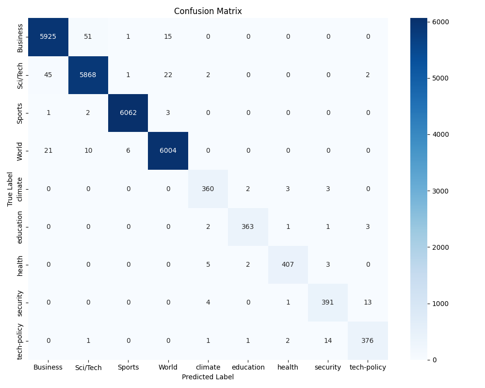

# Module 02 - Lab 04 (LoRA Sub-Lab)

**Focus:** Efficient fine-tuning with Low-Rank Adaptation (LoRA)

## 🧪 Overview
In this sub-lab, we explored how to apply **Low-Rank Adaptation (LoRA)** to a BERT-based text classification model originally trained in Lab 03. The goal was to simulate adapting a general-purpose news classifier to a more domain-specific UK-focused news context with new categories.

## 🗂️ Directory Structure
```
.
├── lab04.py                 # Main training script with LoRA
├── predict.py               # CLI tool to test predictions with softmax output
├── synthetic_news_uk.csv    # Custom UK news dataset (1k samples)
├── confusion_matrix.png     # Evaluation visualisation
├── requirements.txt         # Locked environment dependencies
├── README.md                # This file
└── lora-news/               # Training outputs
    ├── adapter/             # Final LoRA adapter
    ├── full-model/          # Base model + merged LoRA + tokenizer (for quantisation and inference)
    └── checkpoint-*/        # Intermediate training checkpoints
```

## 📊 Dataset
- **File:** `synthetic_news_uk.csv`
- **Size:** 1,000 samples
- **Labels:** `climate`, `education`, `health`, `security`, `tech-policy`
- **Purpose:** Simulates domain-specific shift from general AG News categories

## 🛠️ Key Components

### ✅ `lab04.py`
- Loads pretrained model and tokenizer from Lab 03
- Applies LoRA with `peft`
- Tokenizes and splits the custom dataset
- Trains for 3 epochs on adapter weights (~0.27% of model)
- Evaluates with classification report + confusion matrix
- Merges LoRA adapter into base model using `merge_and_unload()`
- Saves:
  - LoRA adapter only (`lora-news/adapter`)
  - Merged model + tokenizer (`lora-news/full-model`) — ready for quantisation

### ✅ `predict.py`
- Loads full model + adapter
- Accepts input via CLI
- Returns top-5 label predictions with confidence scores via softmax

Example:
```bash
$ python predict.py "Government announces new cybersecurity bill targeting data privacy"
📢 Top 5 Predictions:
  - tech-policy  0.9340
  - security     0.0658
  - climate      0.0001
  - education    0.0001
  - health       0.0000
```

## 📈 Evaluation Summary
- **Accuracy:** ~99%
- **Confusion matrix:** `confusion_matrix_9class.png`
- LoRA captured key distinctions, with some label overlap (e.g. `tech-policy` vs `security`)



## 🧩 Notable Design Choices
- Used `safetensors` format for safe, efficient model storage
- Loaded custom tokenizer from Lab 03
- Used `ignore_mismatched_sizes=True` to extend classifier for 9 labels
- Fine-tuned with `peft==0.7.1` + `transformers==4.38.0` for stability
- **Merged adapter with base model before saving** for deployment and quantisation compatibility

## 🧪 Next Steps
- Quantise merged model with PyTorch or Optimum (Lab 04: Part 2)
- Convert to ONNX or deploy via FastAPI or Triton
- Expand dataset to improve generalisation

## ✅ Outcome
A fully functional LoRA-based text classifier adapted to a synthetic UK news domain, trained, merged, and ready for quantisation and deployment with CLI-based prediction support.
