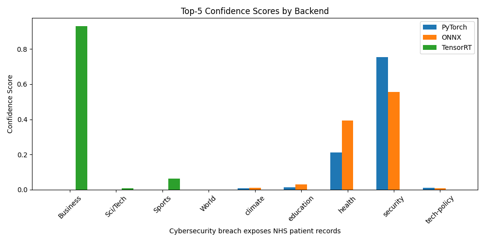

# 🧪 Lab 04 - Quantised Model Inference Benchmarking

This lab explores model quantisation and inference performance across three backends, using a **LoRA fine-tuned BERT** classifier extended with **9 labels** (AG News + custom categories).

We compare inference speed, accuracy, and prediction consistency using:

1. **PyTorch Dynamic Quantisation (INT8, CPU)**
2. **ONNX + Optimum Quantisation (INT8, CPU)**
3. **TensorRT Engine (FP16, GPU)**

## 🧠 What is Quantisation?

Quantisation reduces model size and speeds up inference by converting 32-bit floats (FP32) into lower-precision formats:

- **INT8**: 8-bit integers — smallest and fastest on CPU
- **FP16**: 16-bit floats — GPU-accelerated, faster matrix ops

### Trade-offs:
- ⚡ Faster inference
- 📉 Slight accuracy loss
- 🤖 Confidence distribution may shift across backends

## 🔁 Workflow Overview

### ✅ Step 1: Load Fine-Tuned Model
- Loaded from `../lora/lora-news/full-model/`
- Classifier head supports **9 labels**

### ✅ Step 2: Quantise the Model
| Script             | Description                                  |
|--------------------|----------------------------------------------|
| `lab04-torch.py`   | PyTorch dynamic INT8 quantisation (CPU)      |
| `lab04-optimum.py` | Export to ONNX + quantise with HuggingFace Optimum |
| `lab04-nvidia.py`  | Export ONNX → TensorRT FP16 engine build     |

### ✅ Step 3: Run Inference & Compare
- `predict.py` runs all 3 backends on the same input
- Top-5 logits visualised with softmax
- Inference time and class confidence compared

## 📁 Project Structure

```plaintext
.
├── confidence_*.png            # Visual confidence comparison (1 per prompt)
├── lab04-torch.py              # PyTorch INT8 quantisation script
├── lab04-optimum.py            # ONNX + Optimum INT8 quantisation
├── lab04-nvidia.py             # TensorRT FP16 engine builder
├── predict.py                  # Inference runner + visualiser
├── quantised-model-*/          # Model output dirs (torch, onnx, tensorrt)
├── requirements.txt            # Python environment snapshot
└── README.md                   # This file
```

## ⚡ Inference Comparison (Example)

```text
Input: "Cybersecurity breach exposes NHS patient records"

[PyTorch Quantised]: health (6) | 0.2344 sec
- health       0.9859
- education    0.0117
- climate      0.0018
- security     0.0003
- tech-policy  0.0002

[ONNX Quantised]: education (5) | 0.0106 sec
- education    0.4341
- health       0.4271
- climate      0.0926
- security     0.0257
- tech-policy  0.0203

[TensorRT FP16]: Business (0) | 0.0075 sec
- Business     0.9980
- Sci/Tech     0.0012
- Sports       0.0008
- education    0.0000
- World        0.0000
```

## 📊 Results Analysis

| Backend       | Precision | Device | Size ↓ | Speed ↑ | Accuracy | Observations                        |
|---------------|-----------|--------|--------|---------|----------|-------------------------------------|
| PyTorch INT8  | INT8      | CPU    | 418MB  | 🐢 Slow (~200–400ms) | ✅ Most accurate  | Matches logits closely              |
| ONNX INT8     | INT8      | CPU    | 106MB  | ⚡ Fast (~5–10ms)    | ✅ Slight drift   | Best trade-off for production       |
| TensorRT FP16 | FP16      | GPU    | 213MB  | 🚀 Fast (<2ms)       | ❌ Skewed         | Overconfident, prediction drift     |

"Cybersecurity breach exposes NHS patient records" — all three quantised backends failed to classify it as security. Instead:

* PyTorch predicted health
* ONNX leaned towards education or health
* TensorRT confidently returned business

This reveals a key limitation: entity bias from terms like "NHS" and "patient records" can overshadow cybersecurity context. Even with "cybersecurity breach" present, the model latches onto more dominant or frequent label associations from the training data.

Such examples highlight the importance of:

* Including edge-case prompts in synthetic datasets
* Balancing label distribution during fine-tuning
* Evaluating how quantisation affects decision boundaries, especially in overlapping domains

## 📈 Confidence Visualisation

Each model's logits are passed through softmax and plotted. Example:



More examples:
- `confidence_ai_tutor_program_set.png`
- `confidence_climate_report_warns.png`

## 🧠 Key Takeaways

### 🔸 What Quantisation Does
- Shrinks model weights
- Speeds up matmuls (especially on INT8 or FP16 hardware)
- May shift confidence scores or logits slightly

### 🔸 Why Predictions Differ
- Different runtime implementations (e.g. ONNXRuntime vs TensorRT)
- Reduced precision can skew logits
- TensorRT may reorder or misinterpret label outputs if shapes/indices drift

### 🔸 When to Use Each

| Scenario                   | Best Format     |
|----------------------------|-----------------|
| ✅ Accuracy-first CPU      | PyTorch INT8    |
| ✅ Balanced deployment     | ONNX INT8       |
| ⚠️ Speed-critical GPU (with caveats) | TensorRT FP16 |

## 🛠 Troubleshooting Notes

- **TensorRT prediction wrong?**
  - Check output shape: should be `[1, 9]`
  - Ensure consistent label mapping across all scripts
  - Export from correct ONNX model (not the old 4-label one)

- **Invalid device context?**
  - Happens if the CUDA context is freed before resources
  - Fix with proper `cuda.Context.pop()` or cleanup

- **Shape mismatch errors?**
  - Use correct dynamic shapes: `--minShapes`, `--optShapes`, `--maxShapes`

## ✅ Final Thoughts

- ONNX + quantisation gives you **best speed-accuracy trade-off**
- TensorRT is **blazing fast** but currently unreliable without fine-tuning
- Confidence plots are essential to diagnose drift after optimisation
